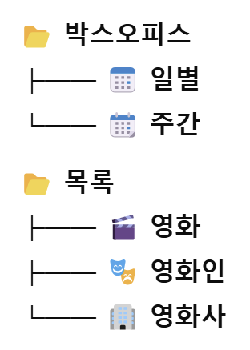
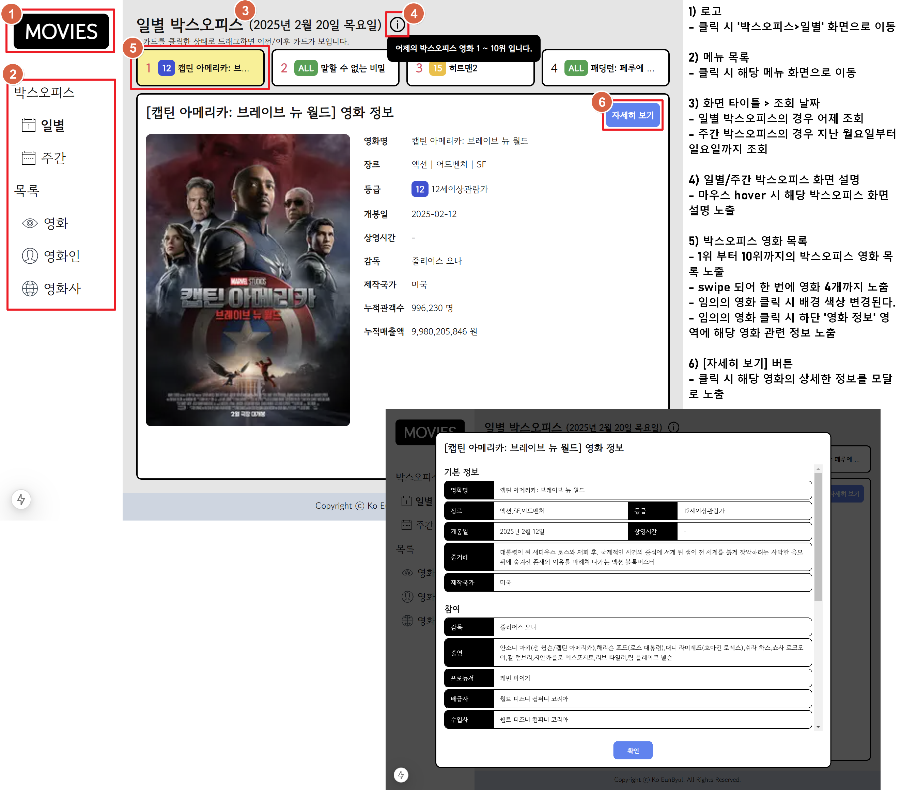
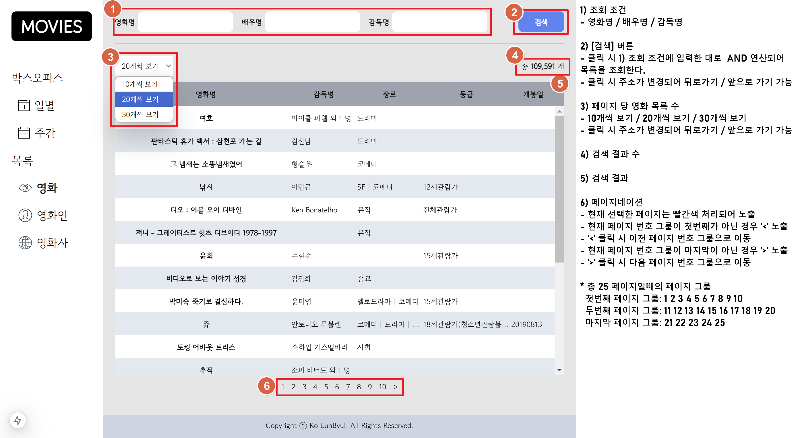
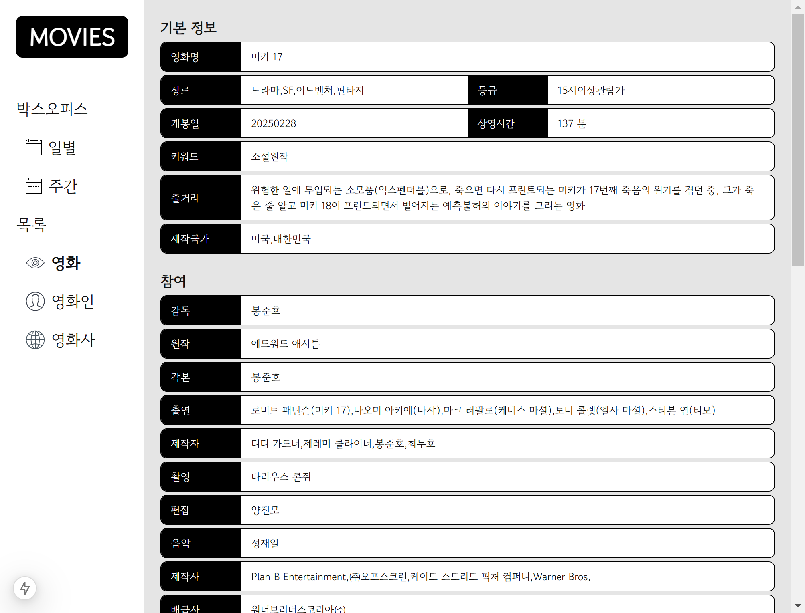

# MOVIES

### 배포된 사이트로 이동
<a href="https://movies-theta-ochre.vercel.app/" target="_blank">MOVIES</a>

### 프로젝트 개요
```plaintext
박스오피스 및 영화 정보를 제공합니다.
```

### 사용한 프레임워크 / 라이브러리
```plaintext
- package manager: yarn berry
- framework: Next ^15.1.3
- state management: zustand
- style: tailwindcss
- code style: prettier
- etc: eslint, swiper, date-fns
```

### 프로젝트 소개
#### 메뉴 구조


#### - 박스오피스 ( 일별 / 주간 )


#### - 목록 ( 영화 / 영화인 / 영화사 )



